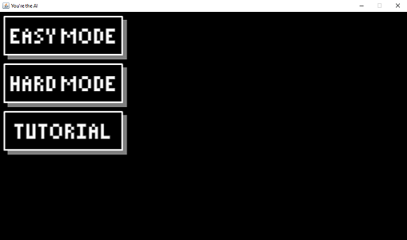
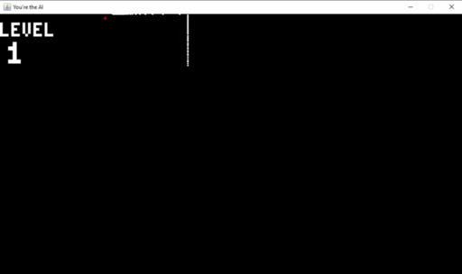

# You're the AI - (Basic) Game
Simple game created as a way to learn Java.

## Table of contents
* [Introduction](#introduction)
* [Technologies](#technologies)
* [General Info](#general-info)

## Introduction
> English not my first language

As a somewhat-new self-taught programmer, I like to challenge myself.
This project in particular was based on a comment in [this video](https://www.youtube.com/watch?v=D5xX6nRWDko).
I thought it could be interesting, so I tried to do it...and here it is.

## Technologies
* Java 15

## General Info
This is a game where the data is not entirely clear, and we're basically blind to the world, just like an AI.

### Overall gameplay
Each time a new game is started, the game generates a new labyrinth (Starting from 3x3).
Your goal is to go from the spawn point (Top-left corner) to the finish cell (Botom-right corner) without hitting any wall.
Your FOV can be rotated, but that only affects what you see, not how you move.

### Easy Mode
You use the power of raycasting to see parts of the labyrinth.

### Hard Mode
You're given a sonar, which tells you distances to the labyrinth's walls.
The sonar also shows your current rotation (Although your move's directions are not affected by it).

